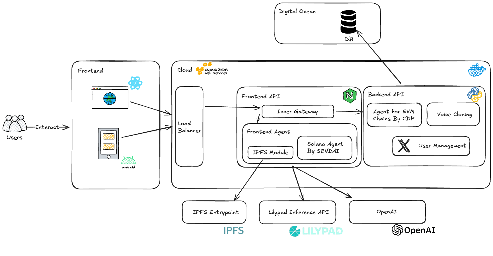

# Current Architecture
## Overview
NexWallet is a cutting-edge platform that combines blockchain technology with artificial intelligence to provide a seamless and intelligent wallet management experience. It supports multiple blockchain networks and offers unique features such as AI-driven transaction signing.
## Key Features
- **Multi-Chain Support**: Solana, Base, Ethereum, Arbitrum, and more.
- **AI-Driven Interactions**: Text and voice command capabilities.
- **Unique Transaction Signing**: First platform to offer AI agent transaction signing.
- **Real-Time Data Integration**: Utilizes Cookie DataSwarm API for up-to-date blockchain data.
- **Robust Security**: Advanced authentication and security measures.
## Technical Documentation
### Architecture Overview
- **Backend**:
  - **API Service**: Handles all blockchain interactions and API requests.
  - **Database**: Utilizes PostgreSQL for storing user data, agent configurations, and transaction history.
  - **Authentication**: Implements OAuth 2.0 for secure user authentication.
- **Frontend**:
  - **React Components**: Reusable UI components for a seamless user experience.

### Detailed Architecture


Our architecture follows a modern cloud-native approach with specialized components for blockchain interactions:

#### User Interaction Layer
- **Frontend**: Built with React.js for web browsers and Android mobile applications, providing a cohesive experience across platforms
- **User Flow**: Users interact with our frontend applications, which route requests through a load balancer to ensure high availability

#### Cloud Infrastructure
- **AWS Cloud**: Hosts our primary infrastructure components
- **Load Balancer**: Distributes traffic efficiently between frontend and backend servers
- **Digital Ocean**: Hosts our database service for cost-efficient and reliable data storage

#### API Gateway Layer
- **Inner Gateway**: Central routing component that handles communication between frontend API and backend API services
- **Frontend API**: Manages user-facing functionality and interfaces with the Frontend Agent
- **Backend API**: Provides core blockchain functionality and specialized services

#### Agent Layer
- **Frontend Agent**:
  - **IPFS Module**: Handles decentralized file storage and retrieval
  - **Solana Agent by SENDAI**: Specialized component for Solana blockchain interactions
- **Backend API Services**:
  - **Agent for EVM Chains By CDP**: Manages interactions with Ethereum Virtual Machine compatible blockchains
  - **Voice Cloning**: Provides voice synthesis capabilities for AI interactions
  - **User Management**: Handles user authentication and profile management

#### External Services
- **IPFS Entrypoint**: Connection to the InterPlanetary File System for decentralized data storage
- **Lilypad Inference API**: AI inference services for transaction analysis and predictions
- **OpenAI**: Integration for natural language processing and AI-driven interactions

This architecture enables NexWallet to provide seamless multi-chain support with AI-powered features while maintaining high performance and security. The modular design allows us to easily add support for additional blockchains and extend functionality as needed.

### User Flow


The user journey through our NexWallet platform follows an intuitive flow designed to maximize ease of use while providing powerful blockchain functionality:

1. **Initial Access**: Users interact with our platform through either the web interface (React) or mobile application (Android).

2. **Authentication Flow**:
   - New users complete a streamlined signup process with secure authentication
   - Returning users authenticate using credentials or biometric options
   - Authentication is routed through our load balancer to the User Management service

3. **Dashboard Experience**:
   - Upon successful login, users are presented with their personalized dashboard
   - The dashboard displays wallet balances across multiple chains
   - AI recommendations appear based on user history and market conditions

4. **Transaction Flow**:
   - When initiating a transaction, the request flows from frontend to load balancer
   - The Inner Gateway routes the request to the appropriate blockchain agent:
     - Solana transactions are handled by the Solana Agent by SENDAI
     - Ethereum and other EVM-based transactions route to the Agent for EVM Chains
   - Smart contract interactions are verified and executed
   - Confirmations flow back through the system to the user interface

5. **AI-Assisted Operations**:
   - Voice or text commands are processed through our Frontend Agent
   - Natural language is interpreted via OpenAI integration
   - Commands are translated to blockchain operations
   - The system can generate voice responses using Voice Cloning services

6. **Data Storage Flow**:
   - User profile data is securely stored in our Digital Ocean database
   - Decentralized content is routed through the IPFS Module to IPFS Entrypoint
   - Transaction history is maintained with links to respective blockchain explorers

7. **Advanced Analytics Path**:
   - Users requesting analytics trigger the Lilypad Inference API
   - AI models analyze transaction patterns and blockchain data
   - Insights are returned to the user with actionable recommendations

This carefully crafted user flow ensures that complex blockchain operations become accessible to users of all technical levels. Through intuitive design and AI assistance, we've created a wallet experience that feels natural while providing the full power of multiple blockchain networks.

## Main changes done in SEND AI
 
 - SolanaAgentKit now includes a callback mechanism.
     
 
 - Private keys are no longer mandatory; public keys can also be used. When using a public key, the UI mode variable must be set to true.
     
# NexWallet Deployment Guide

This guide explains how to set up and deploy the NexWallet application using GitHub Actions and a self-hosted runner.

## Project Structure

- `backend/`: Backend API service written in Python
- `frontend_app/`: Frontend React/Next.js application
- `mobile_app/`: Mobile applications for Android and iOS
- `.github/workflows/`: GitHub Actions workflow definitions

## Prerequisites

- A server with Docker and Docker Compose installed
- GitHub account with access to this repository
- Docker Hub account

## Server Setup

### 1. Install Docker and Docker Compose

If not already installed:

```sh
# Install Docker
curl -fsSL https://get.docker.com -o get-docker.sh
sudo sh get-docker.sh

# Install Docker Compose
sudo curl -L "https://github.com/docker/compose/releases/download/v2.20.3/docker-compose-$(uname -s)-$(uname -m)" -o /usr/local/bin/docker-compose
sudo chmod +x /usr/local/bin/docker-compose
```

### 2. Set Up GitHub Self-Hosted Runner

1. On GitHub, go to your repository → Settings → Actions → Runners
2. Click "New self-hosted runner"
3. Choose your operating system and architecture
4. Follow the instructions to download and configure the runner on your server

Example for Linux:

```sh
# Create a folder for the runner
mkdir actions-runner && cd actions-runner

# Download the runner package
curl -o actions-runner-linux-x64-2.311.0.tar.gz -L https://github.com/actions/runner/releases/download/v2.311.0/actions-runner-linux-x64-2.311.0.tar.gz

# Extract the installer
tar xzf ./actions-runner-linux-x64-2.311.0.tar.gz

# Configure the runner
./config.sh --url https://github.com/YOUR_USERNAME/NexWallet --token YOUR_TOKEN

# Install and start the runner as a service
sudo ./svc.sh install
sudo ./svc.sh start
```

### 3. Prepare the Project Directory

```sh
# Create the project directory
mkdir -p /opt/nexwallet
cd /opt/nexwallet

# Make sure the GitHub Actions runner has permissions to this directory
sudo chown -R RUNNER_USER:RUNNER_USER /opt/nexwallet
```

## GitHub Secrets Setup (For Production Deployment)

The following secrets need to be added to your GitHub repository (Settings → Secrets and variables → Actions) for production deployment. This section is for project maintainers and CI/CD setup.

### Docker Hub Credentials
- `DOCKER_USERNAME`: Your Docker Hub username
- `DOCKER_PASSWORD`: Your Docker Hub password

### API and Service Keys
- `OPEN_AI_KEY`: OpenAI API key for AI features
- `OPENAI_API_KEY`: Alternative OpenAI API key format
- `SECRET_KEY`: Secret key for JWT authentication
- `GRAPH_API_KEY`: GraphQL API key for data queries
- `COOKIE_API_KEY`: Cookie API key for data integration

### Blockchain Integration Keys
- `RPC_URL`: Solana RPC URL
- `SOLANA_PRIVATE_KEY`: Solana private key (for testing only, use OIDC in production)
- `SOLANA_RPC_URL`: Solana RPC URL
- `HELIUS_API_KEY`: Helius API key for Solana
- `FLEXLEND_API_KEY`: FlexLend API key
- `PARA_API_KEY`: Para API key

### Jupiter Protocol Variables
- `JUPITER_REFERRAL_ACCOUNT`: Jupiter referral account
- `JUPITER_FEE_BPS`: Jupiter fee basis points

### Authentication Variables
- `NEXT_PUBLIC_PRIVY_APP_ID`: Privy app ID
- `PRIVY_CLIENT_ID`: Privy client ID
- `PRIVY_CLIENT_SECRET`: Privy client secret
- `PRIVY_API_URL`: Privy API URL
- `PRIVY_VERIFICATION_KEY`: Privy verification key

### Database Variables
- `CONNECTION_STRING`: Full database connection string
- `DB_USER`: Database username
- `DB_PASS`: Database password
- `DB_HOST`: Database host
- `DB_PORT`: Database port
- `DB_NAME`: Database name

### Twitter API Variables (Optional for social features)
- `TWITTER_API_KEY`: Twitter API key
- `TWITTER_API_SECRET`: Twitter API secret
- `TWITTER_ACCESS_TOKEN`: Twitter access token
- `TWITTER_ACCESS_TOKEN_SECRET`: Twitter access token secret
- `TWITTER_CLIENT_ID`: Twitter client ID
- `TWITTER_CLIENT_SECRET`: Twitter client secret

### CDP API Variables
- `CDP_API_KEY_NAME`: CDP API key name
- `CDP_API_KEY_PRIVATE_KEY`: CDP API private key
- `NETWORK_ID`: Network ID for CDP

### Service URLs
- `BACKEND_API_URL`: URL for the frontend to access the backend API

## Developer Setup Guide

If you're a developer looking to clone and run this project locally, follow these instructions:

### Frontend Setup (Next.js)

1. Clone the repository:
   ```sh
   git clone https://github.com/YOUR_USERNAME/NexWallet.git
   cd NexWallet/frontend_app
   ```

2. Install dependencies:
   ```sh
   # Using npm
   npm install
   
   # Using pnpm (recommended)
   pnpm install
   ```

3. Create a `.env.local` file with the minimum required environment variables:
   ```
   # Required for development
   OPEN_AI_KEY=your_openai_key
   BACKEND_API_URL=http://localhost:8000
   NEXT_PUBLIC_PRIVY_APP_ID=your_privy_app_id
   
   # For Solana integration (can use devnet for testing)
   SOLANA_RPC_URL=https://api.devnet.solana.com
   
   # Only if testing specific blockchain features
   HELIUS_API_KEY=your_helius_key
   ```

4. Start the development server:
   ```sh
   npm run dev
   # or
   pnpm dev
   ```

5. Open [http://localhost:3000](http://localhost:3000) in your browser to see the application.

### Backend Setup (Python)

1. Navigate to the backend directory:
   ```sh
   cd NexWallet/backend
   ```

2. Set up a Python virtual environment (Python 3.9+ recommended):
   ```sh
   # Using venv
   python -m venv venv
   source venv/bin/activate  # On Windows: venv\Scripts\activate
   
   # Using Poetry (recommended)
   poetry install
   ```

3. Create a `.env` file with the minimum required environment variables:
   ```
   # Core settings
   SECRET_KEY=your_development_secret_key
   
   # Database (for local development)
   DB_USER=postgres
   DB_PASS=postgres
   DB_HOST=localhost
   DB_PORT=5432
   DB_NAME=nexwallet
   
   # OpenAI for AI features
   OPEN_AI_KEY=your_openai_key
   ```

4. Set up the database:
   ```sh
   # If using PostgreSQL locally
   createdb nexwallet
   
   # Apply database migrations (use the appropriate command based on your ORM)
   python -m alembic upgrade head
   ```

5. Start the backend server:
   ```sh
   python main.py
   # or using Poetry
   poetry run python main.py
   ```

6. The API will be available at [http://localhost:8000](http://localhost:8000).

### Mobile App Setup

1. Navigate to the mobile app directory:
   ```sh
   cd NexWallet/mobile_app
   ```

2. For Android development:
   ```sh
   # Open the project in Android Studio
   # The app is written in native Kotlin
   # After Gradle sync completes, you can run the app directly from Android Studio
   ```

3. iOS App Status:
   ```
   # The iOS native app is currently under development and not ready for use
   # Updates will be provided when the iOS version becomes available
   ```

## Troubleshooting

- **Frontend Connection Issues**: Ensure the `BACKEND_API_URL` points to your running backend server
- **Database Errors**: Verify PostgreSQL is running and accessible with the provided credentials
- **API Key Issues**: Confirm all necessary API keys are correctly set in your environment files
- **Blockchain Integration**: For development, use devnet/testnet endpoints instead of mainnet

## How It Works

1. When you push to the main branch, GitHub Actions will:
   - Check out the code on your self-hosted runner
   - Create .env files with secrets from GitHub
   - Build and push Docker images to Docker Hub
   - Deploy the application using docker-compose

2. The deployment uses environment variables loaded from .env files for each service.

## Manual Deployment (if needed)

If you need to manually deploy:

```sh
cd /opt/nexwallet

# Create .env files (with all variables as shown in the GitHub Secrets section)
# For brevity, this example shows just a few key variables
cat > ./backend/.env << EOF
OPEN_AI_KEY=your_openai_key_here
SECRET_KEY=your_secret_key_here
CONNECTION_STRING=your_db_connection_string_here
# ... add all other variables
EOF

cat > ./frontend_app/.env << EOF
OPEN_AI_KEY=your_openai_key_here
BACKEND_API_URL=your_backend_url_here
# ... add all other variables
EOF

# Deploy with docker-compose
docker-compose pull
docker-compose up -d
``` 